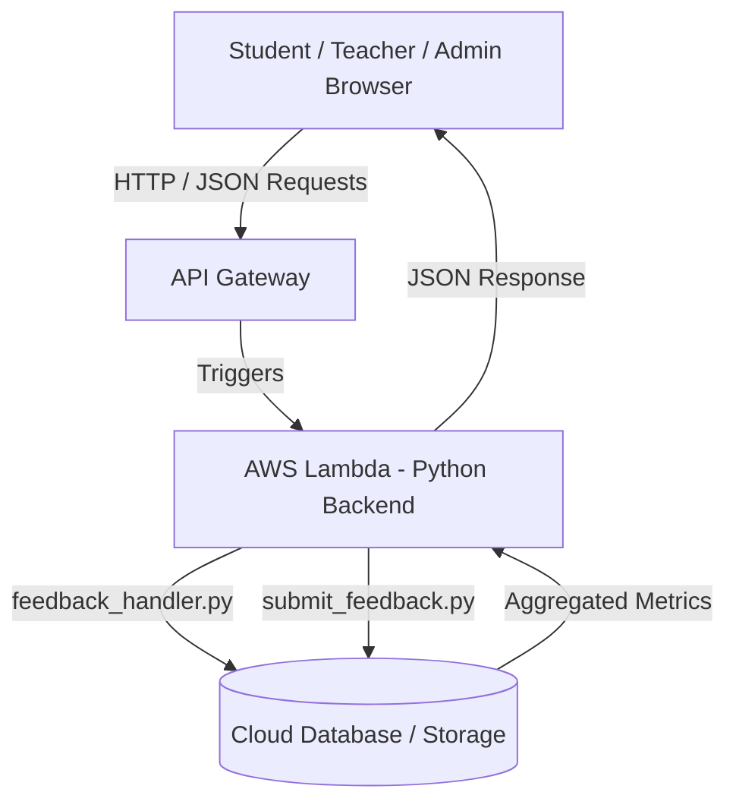

powershell -Command "Set-Content -Path 'README.md' -Encoding UTF8 -Value @'
<div align="center">

# 🌟 Feedback UI App (CampusPulse)

### *Modern, Serverless Student-Teacher Evaluation & Feedback Ecosystem*

[](https://github.com/naveenkvarma/feedback-ui-app)
[](https://reactjs.org/)
[](https://www.python.org/)
[](https://aws.amazon.com/lambda/)
[](https://opensource.org/licenses/MIT)

<p align="center">
  A full-stack, cloud-native feedback platform designed for academic excellence. Featuring dedicated, role-tailored dashboards for <b>Students</b>, <b>Teachers</b>, and <b>Administrators</b> with dynamic rating forms, real-time analytics, and serverless cloud processing.
</p>

[Explore Features](#-key-features) • [Architecture](#-system-architecture) • [Getting Started](#-getting-started) • [Tech Stack](#-tech-stack)

</div>

---

## 📸 UI & Dashboard Highlights

| 🎓 Student Feedback Form | 👨‍🏫 Teacher Analytics Dashboard |
| :---: | :---: |
| *Frictionless multi-criteria rating sliders, responsive cards & dynamic input forms* | *Comprehensive performance analytics, rating trends, and student review feeds* |

| 🛡️ Admin Control Panel | ⚡ Serverless Cloud Ingestion |
| :---: | :---: |
| *Institution-wide oversight, course/batch configuration & faculty mappings* | *Zero-server-maintenance Python AWS Lambda handlers with sub-second response times* |

---

## ✨ Key Features

### 🎓 1. Student Dashboard & Evaluation Portal
- **Intuitive Feedback Forms**: Dynamic multi-criteria rating system covering subject clarity, pacing, teaching methodology, and materials.
- **Confidential & Anonymous Submissions**: Promotes genuine, honest student evaluations with privacy safeguards.
- **Submission History**: Easily track completed evaluations and pending feedback requests in real time.

### 👨‍🏫 2. Teacher Dashboard & Analytics
- **Performance Breakdown**: Visual overview of average ratings, metric distributions, and evaluation summaries.
- **Constructive Insights**: Categorized feedback highlights key strengths and actionable areas for improvement.
- **Course & Batch Filtering**: Seamlessly filter feedback across diverse courses, semesters, and subjects.

### 🛡️ 3. Admin Control Center
- **Campus-Wide Oversight**: High-level reporting and metric comparisons across departments and faculty members.
- **Cycle Management**: Effortlessly launch, schedule, and conclude institutional evaluation windows.
- **Faculty & Course Management**: Manage instructor mappings and student enrollments via structured data.

---

## 🏗️ System Architecture



---

## 🛠️ Tech Stack

| Layer | Technology | Purpose |
| :--- | :--- | :--- |
| **Frontend Framework** | **React.js + Vite** | Fast, modular component-driven web application |
| **Styling** | **Tailwind CSS / Modern CSS** | Sleek glassmorphism, responsive cards, and clean typography |
| **Backend Compute** | **Python (AWS Lambda)** | Event-driven, auto-scaling serverless cloud compute |
| **Cloud Services** | **AWS API Gateway / Lambda** | High-availability, zero-maintenance API infrastructure |
| **Protocol** | **RESTful APIs / JSON** | Lightweight and secure communication |

---

## 📁 Project Directory Structure

```plaintext
feedback-ui-app/
├── backend/
│   └── lambda/
│       ├── feedback_handler.py    # Main API router and request handler
│       └── submit_feedback.py     # Feedback validation & ingestion logic
├── frontend/
│   ├── public/                    # Static assets & icons
│   ├── src/
│   │   ├── components/            # Reusable UI cards, navbars, and buttons
│   │   ├── pages/
│   │   │   ├── StudentDashboard.jsx
│   │   │   ├── TeacherDashboard.jsx
│   │   │   ├── AdminDashboard.jsx
│   │   │   └── FeedbackForm.jsx
│   │   ├── App.jsx
│   │   └── main.jsx
│   ├── index.html
│   ├── vite.config.js
│   └── package.json
├── package.json
└── README.md
```

---

## 🚀 Quick Start Guide

### 1. Clone the Repository
```bash
git clone https://github.com/naveenkvarma/feedback-ui-app.git
cd feedback-ui-app
```

### 2. Frontend Setup
```bash
# Navigate to frontend
cd frontend

# Install dependencies
npm install

# Start local development server
npm run dev
```
> Open your browser and visit **`http://localhost:5173`** (or the port specified in terminal).

### 3. Backend (AWS Lambda) Setup
```bash
# Navigate to backend
cd ../backend/lambda

# Test or run Python lambda handlers
python feedback_handler.py
```

---

## 🤝 Contributing
Contributions, issues, and feature requests are welcome!  
Feel free to open an issue or pull request on the [GitHub Repository](https://github.com/naveenkvarma/feedback-ui-app).

---

## 📄 License
This project is licensed under the **[MIT License](LICENSE)**.

<div align="center">
  <sub>Built with ❤️ by <a href="https://github.com/naveenkvarma">Naveen Kumar Varma</a></sub>
</div>
'@"
